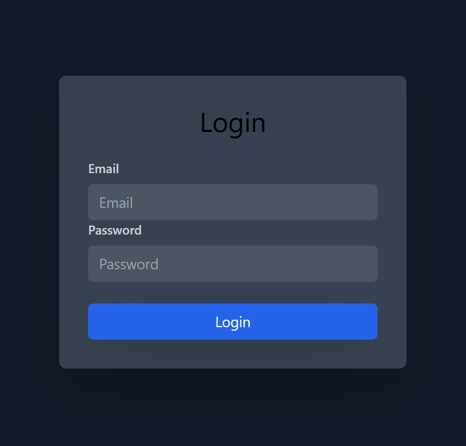

# Login Page (Tailwind CSS)

This is a responsive Login Page built using HTML and Tailwind CSS. It demonstrates a clean, minimal design with a dark theme and interactive form elements.

## Features

- Responsive design
- Tailwind CSS for fast and efficient styling
- Centered login card layout
- Clean UI with hover and focus effects
- Accessible labels and input fields

## Project Structure
login-page/
├── index.html
├── output.css
└── README.md

- `index.html` — Contains the HTML structure for the login form
- `output.css` — Compiled Tailwind CSS file
- `README.md` — Project description file

## Getting Started

### 1. Clone the repository
https://gunjan-kosta.github.io/login-page/

start index.html

Author
Gunjan Kosta
GitHub: https://github.com/Gunjan-Kosta
LinkedIn: https://www.linkedin.com/in/gunjan-kosta

License
This project is open-source and available under the MIT License.
